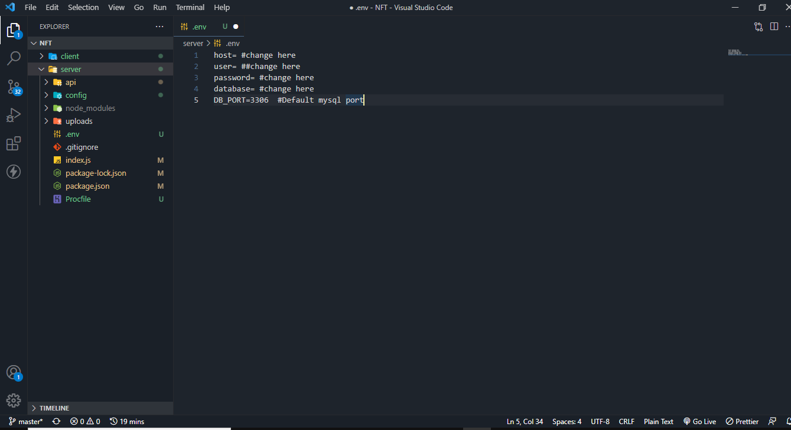
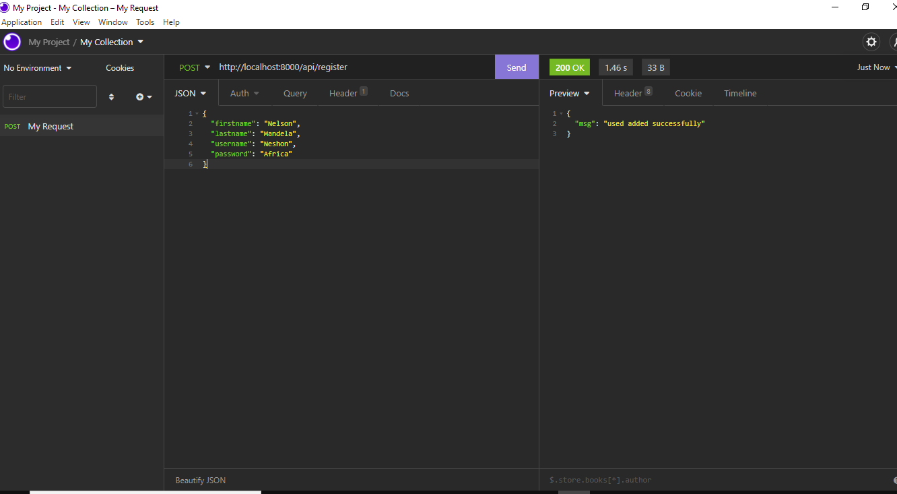
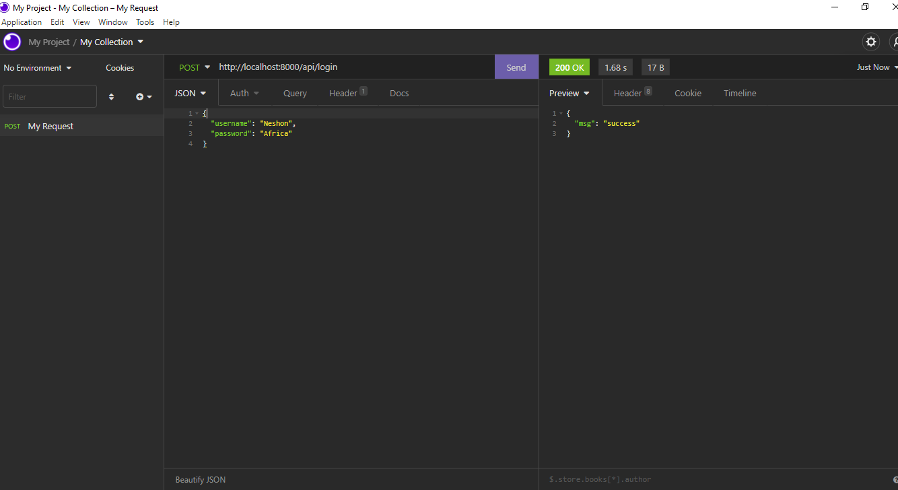
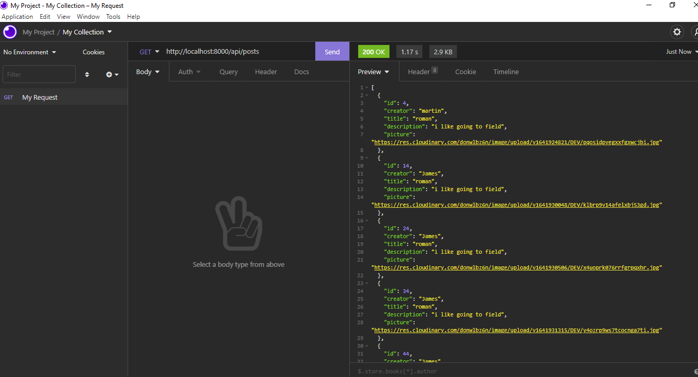

# 🛠️Kenya-Safaris - React, Redux and Node JS Project 🛠 
Kenya-Safaris is an web application that enables Kenyan local tourists to share their travels and tours to different Places. 
## Front-end
The front-end of this application was created using React and Redux.
This client-side React Project demonstrates the following
1. Usage of modern  React Hooks
2. Usage of Redux for state management
3. Usage of the client- server architecture
4. Using Basic Routing in React
5. Deploying the site to Netfily

## Prerequisites

### Install Node JS
Refer to https://nodejs.org/en/ to install nodejs

### Install create-react-app
Install create-react-app npm package globally. This will help to easily run the project and also build the source files easily. Use the following command to install create-react-app

```bash
npm install -g create-react-app

## Cloning and Running the Application in local

Clone the project into local

Install all the npm packages. Go into the project folder and type the following command to install all npm packages

```bash
npm install
```

In order to run the application Type the following command

```bash
npm start
```

The Application Runs on **localhost:3000**

## Kenya-Safari - Server
 Written in Node JS and MySQL datbase
 # Enviroment variables
This is the home endpoint of the api. Change the variables according to your MySQL's username, password and database name.

* You have to create the database manually.
``` SQL
CREATE DATABASE database_name;
```

```
host= ##change here 
user= ##change here
password= #change here
database= #change here
DB_PORT=3306  #Default mysql port
```
<p align="center">
    
</p>

# Register User Endpoint
This is the endpoint to register users to the database.
```HTTP
localhost:8000/users
```

```JSON
{
    "firstName":"Nelson",
    "lastname":"Mandela",
    "username":"Neshon",
    "password":"Africa"
}
```
<p align="center">
    
</p>


# Login User Endpoint
This is the endpoint to login users.

```HTTP
localhost:8000/login
```

```JSON
{
    "username":"Neshon",
    "password":"Africa"
}
```

<p align="center">
    
</p>

# Get All Post Endpoint
This is the endpoint to get all posts in the database.

```HTTP
localhost:8000/users
```

<p align="center">
    
</p>

## Running Locally

Make sure you have [Node.js](http://nodejs.org/) and the [Heroku Toolbelt](https://toolbelt.heroku.com/) installed.

```sh
git clone git@github.com:heroku/node-js-sample.git # or clone your own fork
cd node-js-sample
npm install
npm start
```

Your app should now be running on [localhost:5000](http://localhost:5000/).

## Deploying to Heroku

```
heroku create
git push heroku master
heroku open
```

Alternatively, you can deploy your own copy of the app using the web-based flow:

[](https://heroku.com/deploy)

## Documentation

For more information about using Node.js on Heroku, see these Dev Center articles:

- [10 Habits of a Happy Node Hacker](https://blog.heroku.com/archives/2014/3/11/node-habits)
- [Getting Started with Node.js on Heroku](https://devcenter.heroku.com/articles/getting-started-with-nodejs)
- [Heroku Node.js Support](https://devcenter.heroku.com/articles/nodejs-support)
- [Node.js on Heroku](https://devcenter.heroku.com/categories/nodejs)
